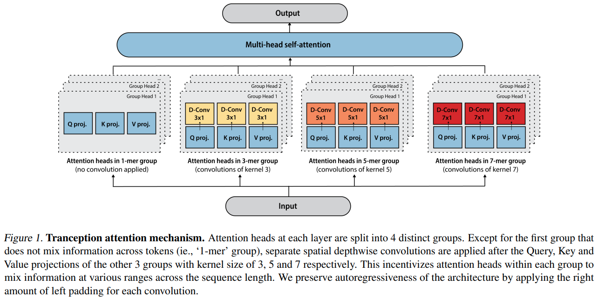

</img>

## Tranception - Pytorch (wip)

Implementation of <a href="https://arxiv.org/abs/2205.13760">Tranception</a>, an attention network, paired with retrieval, that is SOTA for protein fitness prediction. The Transformer architecture is inspired by <a href="https://arxiv.org/abs/2109.08668">Primer</a>, and uses <a href="https://arxiv.org/abs/2108.12409">ALiBi relative positional encoding</a>

## Install

```bash
$ pip install tranception-pytorch
```

## Usage

```python
import torch
from tranception_pytorch import Tranception

model = Tranception(
    dim = 512,
    depth = 6,
    heads = 8,
    dim_head = 64
)

amino_acids = torch.randint(0, 21, (1, 512))

logits = model(amino_acids) # (1, 512, 21)
```

## Todo

- [x] grouped heads with customizable depthwise convs (for variable k-mers), as well as grouped alibi pos bias
- [ ] figure out attention to retrieved (looks like axial attention?)
- [ ] play around with protein gym, and start betting on huggingface's accelerate

## Citations

```bibtex
@article{Notin2022TranceptionPF,
  title   = {Tranception: protein fitness prediction with autoregressive transformers and inference-time retrieval},
  author  = {Pascal Notin and Mafalda Dias and Jonathan Frazer and Javier Marchena-Hurtado and Aidan N. Gomez and Debora S. Marks and Yarin Gal},
  journal = {ArXiv},
  year    = {2022},
  volume  = {abs/2205.13760}
}
```
